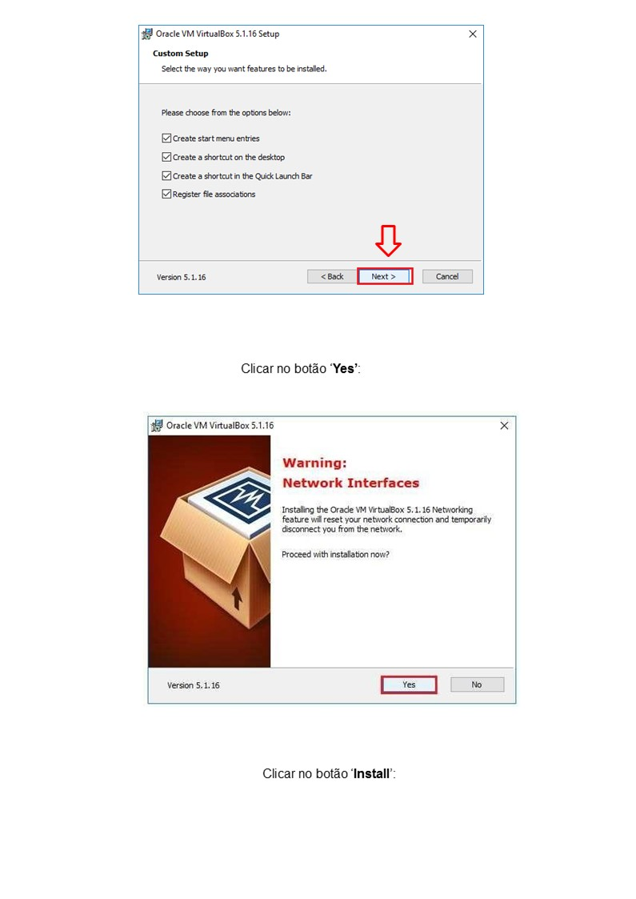
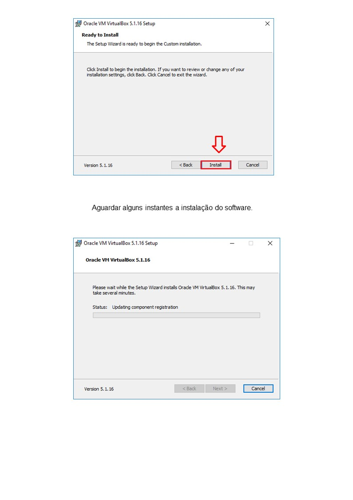
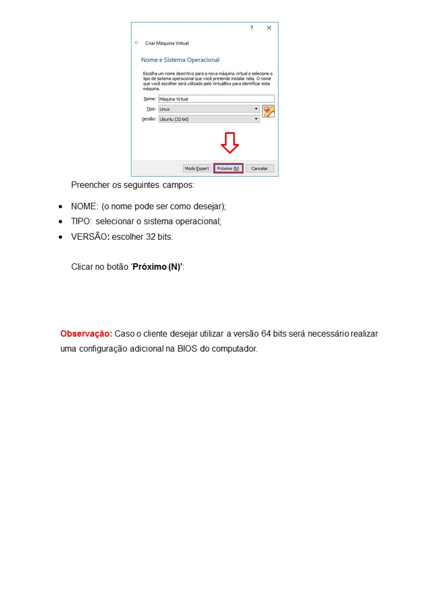
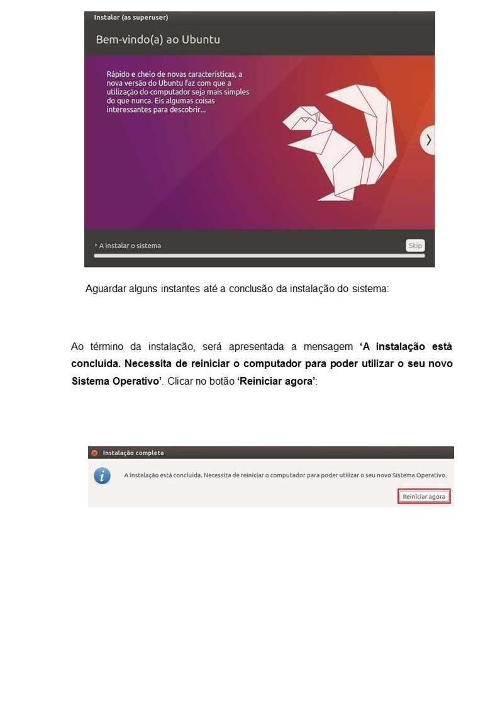
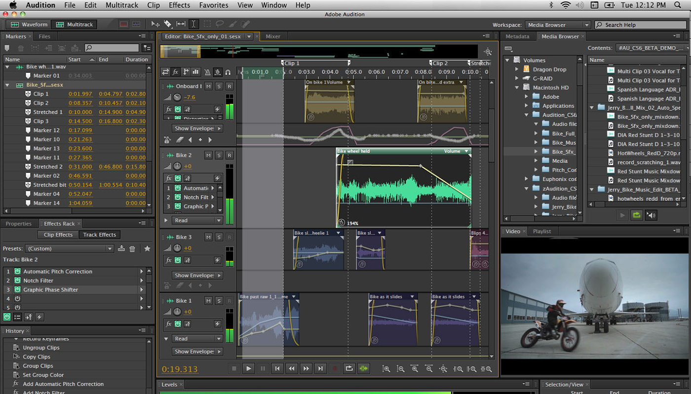

# TUTORIAL_LINUX

<h1>
Adobe Audition
</h1>

  

<h3>Adobe Audition</h3> 

É um DAW da Adobe Systems, com multi-pistas, ambiente "não-destrutivo" de edição e mistura, assim como edição waveform "destrutiva".

Originalmente, este programa chamava-se "Cool Edit" e era distribuído sob licença shareware com algumas características crippleware, existindo também versões comerciais, denominadas "Cool Edit Pro". A Adobe adquiriu a versão comercial deste programa, o "Cool Edit Pro 2.0" à empresa "Syntrillium Software" em Maio de 2003. Alteraram então o nome para "Adobe Audition" e lançaram-no a 18 de Agosto desse ano sob a versão 1.0.

O Adobe Audition 1.0 era muito semelhante à versão 2.0 da outra empresa. E só na versão 1.5 da Adobe, lançada em Maio de 2004, é que se notaram melhoramentos, quanto à correcção de pitch, edição de espaço de frequência, uma biblioteca com mais loops, visualização de projecto para gravação em CD, edição de vídeo básica, e integração com o Adobe Premiere, assim como melhoramentos em outras funções.

 

<h3>Características</h3>

Misturas multi-pistas em estéreo, até 128 pistas
Encoder multi-canal para produção de som surround 5.1 de alta qualidade.
Permite gravação de áudio em CD
Inclui cerca de 5000 loops
Remoção de audio flaws com efeitos acessíveis
Importa e exporta em vários formatos de arquivo, incluindo MP3, WAV, Windows Media Audio Professional, AIFF, SND, e vídeo AVI
Inclui 50 ferramentas de processamento de sinal digital de alta qualidade, e efeitos destinados a restauração de áudio, misturas e mastering.
Os projectos podem ser interligados aos programas Adobe Premiere e o Adobe After Effects

  

  <h1>
Ardour OPEN SOURCE
</h1>

  
  <h3>Ardour</h3>  
  

Ardour é um DAW livre desenvolvido sob licença GPL. Atualmente é suportado nas plataformas Linux, FreeBSD, Solaris, Mac OS X e Microsoft Windows. Seu primeiro autor foi Paul Davis, também responsável pelo JACK Audio Connection Kit. O objetivo do software Ardour é possibilitar a edição de áudio digital profissional.

<h3>Características</h3>

  

O Ardour suporta áudio digital em taxas de amostra arbitrárias, até o limite da capacidade do hardware, bem como a entrada e saída de diferentes formatos de arquivos. As tecnologias de controle MMC (MIDI Machine Control) e MIDI podem ser usadas para controlar a mixagem tanto manual como automaticamente.

O software Ardour oferece algumas variações notáveis nas funções habituais de edição de áudio. Fades, por exemplo, são aplicados em tempo real à medida que são modificados. Vários modelos diferentes de camadas de região também são suportados. O software permite desfazer/refazer instantaneamente e a facilidade de armazenar versões interessantes ou úteis de uma sessão.

Alguns utilizam o Ardour como um ambiente de masterização de áudio. Sua integração com o JACK torna possível a utilização de ferramentas de masterização como o en:JAMin para processar dados de áudio. O Ardour pode também exportar arquivos TOC e CUE, que permitem a criação de arquivos para CDs.

<h3>Compatibilidade</h3>
  

O Ardour suporta plugins que habilitam vários tipos de efeitos de áudio, com controles dinâmicos. Ardour suporta o plugin LADSPA, Steinberg's VST e plugins padrão com o software Wine.

Como o Ardour é uma aplicação livre e open source, qualquer um pode ler seu código fonte. Isto permitiu que a primeiro porte do Ardour para Mac OS X fosse desenvolvido por alguém não envolvido com o projeto do Ardour.[1] O Ardour tenta aderir as indústrias padrão para maximizar sua funcionalidade e fácil portabilidade

<h3>Colaboração de empresas</h3>

